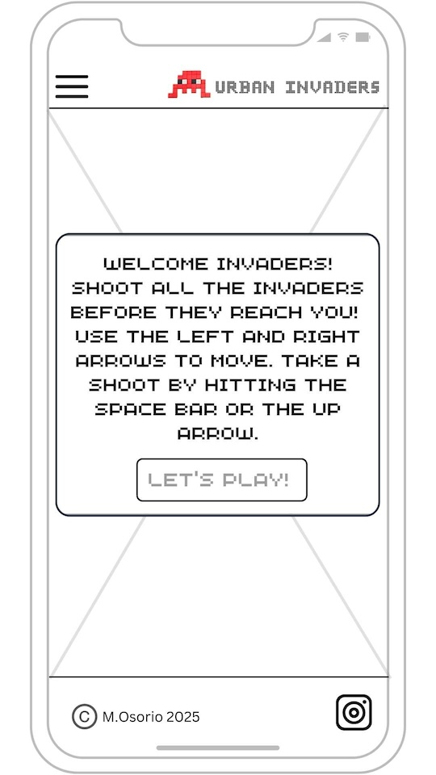

# URBAN INVADERS
 

The deployed website can be found here: [Urban Invaders](https://osoriomica.github.io/invaders/index.html)  

## Introduction
 

Urban Invaders is a playful take on the street art by French artist Frank Slama and the original Space Invaders arcade game.

It’s become a personal habit of mine to photograph (or shoot) these Invader installations whenever I happily come across them whilst walking on the streets of my city or as a tourist somewhere else.  
This project comes from a mix of arcade nostalgia, my interest in street art, and our modern compulsive need to capture stuff in photos. The user controls the shooter as usual, but on this occasion, they are tourists with their cameras shooting photos of the invaders crawling down a building. I hope to capture some of that original fun with a twist on my version of Space Invaders. 

 

### About the original Space Invaders:
  
[Image by Arcade Museum](https://en.wikipedia.org/w/index.php?curid=41622028), Fair use.

Released in 1978 by Taito Corporation, and designed by Tomohiro Nishikado [Space Invaders](https://en.wikipedia.org/wiki/Space_Invaders) is considered one of the most influential and greatest games of all time. After almost half a century since its origins, it has continued to be a part of pop culture across the globe, inspiring people daily with its simplicity and iconic design. 

### About Frank Slama (AKA Invader)
One of my favourite street artists, Franck Slama (AKA Invader), has given the famous alien invaders and their unmistakable pixelated art a new life by installing, pixelated ceramic tiles on public walls around the world. His artwork features the invaders as well as other famous characters from old-school video games like Mario Bros. and Pac-Man. 
- See space-invaders website for more info on his work: (https://www.space-invaders.com/home/).

 [By Julie - Own work, CC BY-SA 4.0](https://commons.wikimedia.org/w/index.php?curid=50343315)

## User Experience

### User stories
Space Invaders recalls the nostalgia for the Golden Age of arcade games but also, it’s a simple and fun game to play. 
Therefore, the user of this website is someone who'd like to play a quick shooting game based on Space Invaders. Or someone who shares the interest (or maybe has just come across) an installation by Invader.   

- As a user, I’d like to understand how to play the game.
- As a user, I’d like to play the game with simple controls.
- As a user, I would like to easily start a new game.
- As a user, I’d like to choose my shooter.
- As a user, I’d like to be able to pause, resume and/or start a new game.
- As a user, I’d like to control the audio effects/background music.  
- As a user, I’d like to know my score at the end of the game.
- As a user, I’d like to know if I’ve lost or won the game. 

### Features
Layout: The website is presented in two pages. The homepage and the game page. The focus relies on the game as the main feature. 
#### General features across the site:
- The logo, title and navigation menu with two links: Home and Play Urban Invaders.
- A simple footer with social media icons to open in a new tab Facebook and Instagram websites.
#### Homepage: 
- Welcome message: the homepage has a simple welcome message styled like a French road sign (blue background, white inner border and text written in white uppercase -but with an arcade-inspired font).
- Instructions: the welcome message offers quick instructions on how to play the game. 
- Link: to the game page. 
#### Game page:
- Modal: on page load, a bootstrap modal is displayed with 3 shooter options to choose before starting the game.  
- Button to close the modal reads "Start Game”.
- Score display: below the navigation menu, centered with yellow text for contrast. The game over or winning messages are updated on the same line.
- Game Options: Two buttons below the score and above the game’s grid: New Game and Pause/Resume.
- Game Board: on a square box with dark semi transparent background. The invaders and the shooting camera are placed within. 
- Game Controls: Big arrow buttons and the selected shooter are placed directly below the grid. The user can play without a keyboard using these buttons.  
- Sound controls: The user can click on the audio icon to toggle the sound on and off.
- Sound effects: Currently, the game has 3 sound effects stored in a javascript object:
	1. Camera flash: triggered on clicking the shooter to emulate a camera's shutter.
	2. Game Over: played when an user looses the game.
	3. Success: played when an user wins the game.
##### Game Logic: 
- On game start, the shooter is placed at the bottom centre of the grid. The group of invaders appear at the top left corner and start moving side to side, descending towards the shooter.
- Using Left and Right arrows (on keyboard and on-screen), the user can move the shooter side to side but not past the edge of the grid. 
- Using the Up arrow or the spacebar on the keyboard (or clicking on the shooter's icon on-screen), the user can fire against the invaders. 
- Each time the shooter hits an invader, it disappears and the score is increased by one. 
- The game is won by destroying all the invaders before they touch the shooter or the bottom of the grid.
- The game is lost if the invaders reach the shooter or the bottom of the grid. 
- Game Over: the end of the game. The score display is updated with the final score and a Congratulations! Or Game Over message. 

	#### Possible features to add in a future deployment:
	- Scoreboard with a top 10 of the highest scores and the user’s initials. 
 	- Boss to increase difficulty of the game. Random math drop bomb to shooter? (Nice to have if more time)
	- Share score to social media.
	- Report an issue link to write an email to developer. 
	- Option to add levels of difficulty (faster invaders, bosses, etc)

### Design	
The overall design is inspired by the original arcade aesthetic and Invader’s street art installations (see introduction).
The colour palette is high-contrasting and the text elements easy to read.
The buttons and links are formatted so that the user can interact intuitively.

- Colour Palette: 

	| Color      | Hex                                         | Name                             |
	| ---------- | ------------------------------------------- | ---------------------------------|
	|  | #252c3f | Space Cadet |
	|  | #ff9f1c | Orange Peel |
	|  | #dddddd | Antiflash white | 
	|  | #102542 | Oxford Blue |
	|  | #ba0003 | Enginneering Orange |

- Typography. Chosen for its pixelated styles to emulate an arcade's game -imported from Google Fonts: 
	- Press Start 2P: Headings and highlighted buttons.
	- Jersey 15:  General text elements. 
- Sounds and music: pixabay.com. The sounds are within a javascript object so there's room for future expansion.
- Graphics: SVGs edited from canva.com - all characters have a pixelated style to resemble the Space Invaders game and Invader's art installations.
- Background: A shot of a street in Paris. Photo taken and edited by the developer.  
- Text signs: Styled to resemble the French road signs to continue the idea of street art.

## WIREFRAMES  
I used canva.com for the overall design and the [mock-up process](README-folder/wireframes/canva-mockups). These wireframes then allowed me to start experimenting with the colours and visual elements such as the svgs used across the site. 

### Information Architecture diagram

 Please click here to open the <strong>MOBILE WIREFRAMES:</strong>  

  

Please click here to open the <strong>LARGE SCREEN WIREFRAMES:</strong> 

### Technologies used:
- Languages: HTML5, CSS3, JS 
- Bootstrap 5.2.3 - to enhance the visual appearance of the website as well as the [built-in modal component](https://getbootstrap.com/docs/4.0/components/modal/) used alongside custom CSS styles
- GitHub - to host the project  
- Visual Studio Code - IDE connected to GitHub codespaces
- Google Fonts - Find and import font families
- canva.com - Create, edit and export [sprite elements](https://www.canva.com/design/DAGcibDIbGE/Kb27D79L8M__OToY9XiEmg/edit?utm_content=DAGcibDIbGE&utm_campaign=designshare&utm_medium=link2&utm_source=sharebutton). [Draft wireframes and overall design](https://www.canva.com/design/DAGcSUaYHVU/TzfS5spG1CXN-vaJxABJHw/edit?utm_content=DAGcSUaYHVU&utm_campaign=designshare&utm_medium=link2&utm_source=sharebutton) before translating it to html/css code.
- pixabay.com - to download free sound effects
- coolors.co - Create the colour palette
- Font Awesome - arrow icons on index.html and social icons on footer
- cloudconvert.com - convert and optimise images for the web
- mdn web docs - for general coding reference: Loops and iteration, audio(), location.reload(), working with objects, etc.
- Lighthouse - to improve the site's general score by following their suggestions on performance, accessibility, best practices and SEO 
- prettier.io - to beautify the js and css code
- Google's Inspect Element - to debug code and see console logs and errors
- [tabletomarkdown.com](https://tabletomarkdown.com/convert-spreadsheet-to-markdown/): to easily generate my testing table by importing it from a spreadsheet

## TESTING
### HTML Validation
- Homepage:  
[link to html validator](https://validator.w3.org/nu/?doc=https%3A%2F%2Fosoriomica.github.io%2Finvaders%2Findex.html)  
- Invaders:  
[Link to html validator](https://validator.w3.org/nu/?doc=https%3A%2F%2Fosoriomica.github.io%2Finvaders%2Finvaders.html) 
- 404:   
[link to html validotr](https://validator.w3.org/nu/?doc=https%3A%2F%2Fosoriomica.github.io%2Finvaders%2F404.html)  

### CSS
- W3C CSS Validation: [Link to css validator](http://jigsaw.w3.org/css-validator/validator?lang=en&profile=css3svg&uri=https%3A%2F%2Fosoriomica.github.io%2Finvaders%2Fassets%2Fcss%2Fstyle.css&usermedium=all&vextwarning=&warning=1)  

          
### JS 
app.js was tested using (https://jshint.com/). Three directives were added at the top of the js file to inform JSHint about the use of bootstrap (global bootstrap), to ignore the missing semicolons (-W033), and the use of the esversion: 8 (so that let and const were not flagged). No warnings were thrown after this.

### LIGHTHOUSE
The website was tested with Google Chrome's Lighthouse
- Homepage:   

- Invaders:  

- 404 -due to its error nature, the general score was affected:  
 

### Testing user stories
- As a user, I’d like to understand how to play the game:
	- The welcome message offers a quick guide on the game controls and logic.
	- I am offered a choice of 3 shooters with a clear message prompting me to choose one. 
	- If I hover over the game controls and buttons, I can see a visible change in their styles so I know they are interactive.
- As a user, I’d like to play the game with simple controls:
	- I can see clear high-contrasting buttons at the top the screen with New Game and Pause/Resume texts. 
	- I click on the on-screen arrows and shooter to play game. I can use the keyboard as well.
- As a user, I would like to easily start a new game:
	- There is a clear button that on starts a new game on clicking it.  
- As a user, I’d like to choose my shooter: 
	- The initial modal on the game's page offers a choice of 3 shooters before starting the game.
- As a user, I’d like to be able to pause, resume and/or start a new game:
	- I can clearly see the buttons on top of the screen offering me the option to pause, resume and/or start a new game.
- As a user, I’d like to control the audio effects/background music:
	- There's an clickable sound icon on the bottom right corner that toggles the sound on and off.  
- As a user, I’d like to know my score at the end of the game:
	- The final score and result are updated on the top of the page using a bright yellow font. 
- As a user, I’d like to know if I’ve lost or won the game:
	- The score display is updated at the end of the game letting me know if I've won or lost the game.

### Functionality Testing
| Test Label                   | Test Action                                               | Expected Outcome                                                                                                                                                                                                                                  | Test Outcome |
| ---------------------------- | --------------------------------------------------------- | ------------------------------------------------------------------------------------------------------------------------------------------------------------------------------------------------------------------------------------------------- | ------------ |
| Site’s responsiveness        | Resize site with Inspect Tool using different dimensions. | The site remains easy to read and uncluttered across different screen sizes. Images and text change depending on media queries.                                                                                                                   | Pass         |
| Header:                      |                                                           |                                                                                                                                                                                                                                                   |              |
| Logo \| title                | Click on logo and title                                   | Links to homepage                                                                                                                                                                                                                                 | Pass         |
| Dropdown menu toggle         | Resize screen                                             | The navigation menu is collapsed into a dropdown menu for mobile screens and expanded with all links displayed on large screens                                                                                                                   | Pass         |
| Styling                      | Resize the screen, hover/click on buttons                 | Menu is responsive and the links are displayed clearly on the screen or on dropdown (mobiles).                                                                                                                                                    | Pass         |
| Navigation links             | Click on links, check code                                | Opens requested page and updates the menu showing an active status                                                                                                                                                                                | Pass         |
| Buttons:                     |                                                           |                                                                                                                                                                                                                                                   |              |
| Styling                      | Hover and click buttons                                   | On hover and when clicked, buttons change their styling to let user know they can interact with them.                                                                                                                                             | Pass         |
| Modal: Start Game            | Click button                                              | Close the modal and starts the Invaders interval.                                                                                                                                                                                                | Pass         |
| Shooter Options              | Click on selected shooter                                 | On clicking each shooter on the modal, the game controls are updated with selected shooter                                                                                                                                                         | Pass         |
| Invaders: Start/Pause/Resume | Click button                                              | If the modal is closed with esc, the button reads Start. On click it starts the game interval and turns to Pause. On click, it pauses the game, prevents the shooting event and turns to Resume. On click it resumes the game and turns back to Pause. | Pass         |
| Invaders: New Game           | Click button                                              | It reloads the page, starting the game anew.                                                                                                                                                                                                      | Pass         |
| Sound Toggle                 | Click button                                              | It toggles the sound effects on and off.                                                                                                                                                                                                          | Pass         |
| Homepage: Let’s Play         | Click button                                              | Opens invaders.html                                                                                                                                                                                                                               | Pass         |
| 404:  Go back home           | Click button                                              | Returns to homepage                                                                                                                                                                                                                               | Pass         |
| Gameplay:                    |                                                           |                                                                                                                                                                                                                                                   |              |
| Start Game                   | Click start buttons                                       | The invaders start moving and the game starts                                                                                                                                                                                                     | Pass         |
| Move invaders                | On gameplay                                              | On start, the invaders start moving left to right and downwards.                                                                                                                                                                                  | Pass         |
| Move shooter                 | Click left and right arrows on keyboard and/or on screen  | The shooter is moved one space to either left or right and the flash is shot from the new location.                                                                                                                                               | Pass         |
| Shoot                        | Click arrow up, spacebar or on-screen shooter             | It triggers the moving flash and the camera sound.                                                                                                                                                                                                | Pass         |
| Remove Invaders              | Shoot the invaders on gameplay                           | When hit by the flash, the invader is removed from the grid and the score is increased by one.                                                                                                                                                    | Pass         |
| padScore                     | On gameplay                                              | On shooting an invader, the score’s format is displayed in 3 digits                                                                                                                                                                               | Pass         |
| Game Over                    | On gameplay                                              | If no more invaders are left, the game is won. If the invaders touch the shooter or reach the bottom row, the game is lost. A message is displayed to let users know the result of the game.                                                       | Pass         |
| Footer:                      |                                                           |                                                                                                                                                                                                                                                   |              |
| Social links                 | Click                                                     | Links open a new tab to Facebook or Instagram                                                                                                                                                                                                     | Pass         |
| Styling                      | On scroll down/up                                         | The footer is revealed or hidden when the user scrolls down or up.                                                                                                                                                                                | Pass         |
| 404:                         |                                                           |                                                                                                                                                                                                                                                   |              |
| Error page                   | On wrong url                                              | When a wrong url address is given, GitHub automatically redirects to a 404 custom page with the clear option to take the user back to the index page.                                                                                             | Pass         |

### Fixed Bugs
- <strong>Navbar toggle not behaving properly.</strong> Issue: Target was not set to correct ID. Fix: Using bootstrap’s documentation, I made sure both the parent’s data-bs-target and the id of its descendant div were the same.  
- <strong>Background image on .main-text-bg not displaying responsively.</strong> Issue: The text would overflow the container and the image was not growing with its parent div. Fix: set width to 100%, and height to 100vh so the text would stop overflowing and the image would occupy the full width of its container.
- <strong>Start game modal closing but not initialising game.</strong> The default setting for bootstrap's modal allows the user to click outside the modal to dismiss it, but if the user did this instead of pressing the start game button, the setInterval was not being updated by the startGame(). Fix:  Set backdrop to static (the modal will not close when clicking outside of it) to force the user to click the Start Game button.
- <strong>Function restart - button event doesn't reset the game state properly.</strong> Score goes back to 0 but Invaders continue moving. Expected: As well as the score/results display, the remaining invaders should disappear and reappear in their initial position with original numbers. Fixed: use the built-in method location.reload() to reload the page, and reset the game state to its original status.
- <strong>ToggleSound function not loading audio within new soundsList object.</strong> Fix: update the if statement to include the object via dot notation: boomSFX.play() => soundsList.boomSFX.play() 
- <strong>Restart game function not reinitialising the game fully.</strong> Issue: originally the code was trying to reset all constants back to their orignal values but not working properly. Fix: the function simply triggers the method location.reload() for restarting game by reloading the [current window](https://developer.mozilla.org/en-US/docs/Web/API/Location/reload)
- <strong>Shoot event not being paused on clicking the pause button.</strong> Fix: create a global constant isGamePaused and add a guard close to stop the shooting event from happening if the constant is true.
- <strong>Game not ending if the invaders reached the bottom</strong> without touching the shooter triggering a console error. Fix: Create a new constant using the divs on the bottom row and checking against the invaders class to trigger the game over.
- <strong>Console error re:flash id</strong> Issue: the flash would continue to travel upwards indefinitely taking the index to negative numbers. Fix: Add a guard clause to return the function if the flash's index went out of bounds.
- <strong>Social links not being able to be clicked on homepage on mobile screens.</strong> Issue: the height of the main text element was set 100vh on a higher z-index than the footer's thus covering the icons and preventing the user from clicking on them. Fix: Set the height to 90vh. 

## DEPLOYMENT
For a future deployment, it would be best practice to optimise all imagery used to increase loading times. I would also like to digitalise the printed menus and have them as downloadable files on the homepage. I would like to add a donations section and a relevant link on the About us page. 

For deploying the website I followed the following steps:  
1. Go to the Settings tab of your GitHub repo.  
2. On the left-hand sidebar, in the Code and automation section, select Pages.  
3. Make sure:  
    * Source is set to 'Deploy from Branch'. 
    * Main branch is selected. 
    * Folder is set to / (root).  
4. Under Branch, click Save. 
5. Go back to the Code tab. Wait for the build to finish and refresh your repo. 
6. In the Environments section, click on 'github-pages'. 
7. Click View deployment to see the live site.  

**To clone and deploy this project**
From your account of Github, visit my repository [Urban Invaders](https://github.com/osoriomica/invaders) 
Locate the Project GitHub repository and click the green "Gitpod" icon on the top right corner of my repo to start a new Gitpod workspace. 
You then have the option of working locally or downloading the project locally to be edited with an IDE such as VS code. 

## CREDITS
### Code
- The base javascript code for the game comes from Ania Kubów: (https://youtu.be/s6LrpUTQQn0?si=DZ24tUrVomU48pgm)
- GameOver on reaching the bottom row by SCollins: (https://github.com/SJECollins/ci-pp2-pixels-arcade/tree/main)
- Audio() constructor: (https://developer.mozilla.org/en-US/docs/Web/API/HTMLAudioElement/Audio)
- Location.reload(): (https://developer.mozilla.org/en-US/docs/Web/API/Location/reload)
- Bootstrap documentation for general reference.
	
### Media
- Invader cut out and edited from photo by Guilhem Vellut from Paris, France. https://www.flickr.com/photos/o_0/28023125416/  
- Pixelated camera icon⁠ edited from the original by Rara nia nur hanifa on Canva.com https://www.canva.com/icons/MAFYvLietmQ/  
- Star Pixel Art⁠ from chickchick on Canva.com https://www.canva.com/photos/MAGSKDopQAg/  
- Road sign image edited from image listing https://www.ebay.it/itm/314175660736  
- Shooter1 based on the artwork by Patinya_P_ANG on Canva.com https://www.canva.com/photos/MAFs6D_S9Rs/  
- shooter2 made using Pixel art green retro hat by Patinya_P_Ang from Patinya_P_ANG https://www.canva.com/photos/MAFrmC84tXI/
- shooter3 cat pixel by FranGeL Katerns https://www.canva.com/icons/MAGRfqjLFK4/

#### Sound effects: 
- Camera capture sound effect by <a href="https://pixabay.com/users/freesound_community-46691455/?utm_source=link-attribution&utm_medium=referral&utm_campaign=music&utm_content=6448">freesound_community</a> from <a href="https://pixabay.com//?utm_source=link-attribution&utm_medium=referral&utm_campaign=music&utm_content=6448">Pixabay</a>
- negative_beeps sound effect by <a href="https://pixabay.com/users/freesound_community-46691455/?utm_source=link-attribution&utm_medium=referral&utm_campaign=music&utm_content=6008">freesound_community</a> from <a href="https://pixabay.com//?utm_source=link-attribution&utm_medium=referral&utm_campaign=music&utm_content=6008">Pixabay</a>
- success sound effect by <a href="https://pixabay.com/users/updatepelgo-44563794/?utm_source=link-attribution&utm_medium=referral&utm_campaign=music&utm_content=221935">UpdatePelgo</a> from <a href="https://pixabay.com/sound-effects//?utm_source=link-attribution&utm_medium=referral&utm_campaign=music&utm_content=221935">Pixabay</a>

### ACKNOWLEDGEMENTS
Thanks to my mentor Brian Macharia for his time and amazing way of explaining stuff in such a brilliant manner.  
To the many inconspicuous invader tiles I've stumbled across over many years for the inspiration to make this project.  